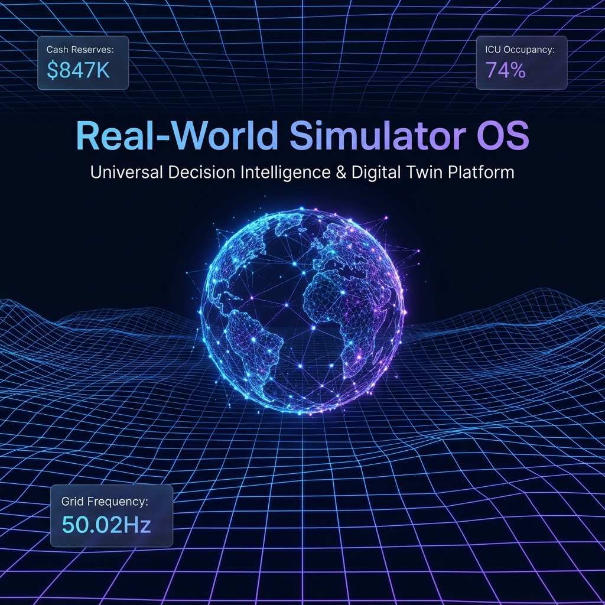
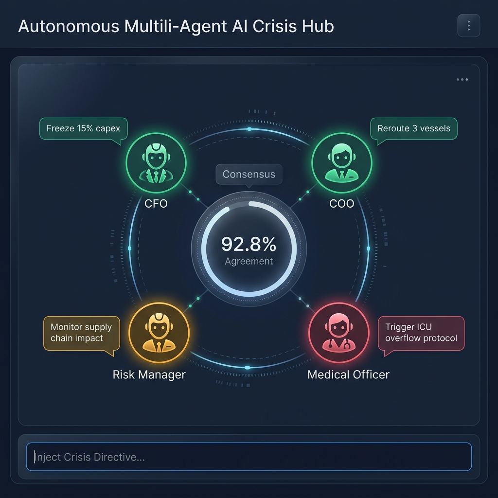
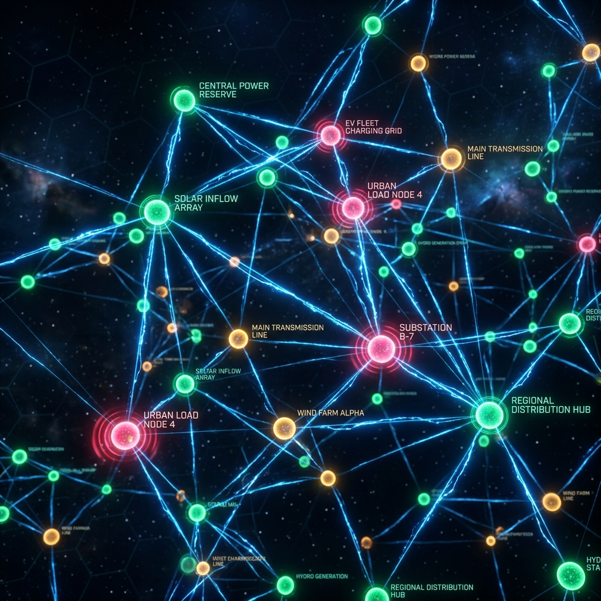
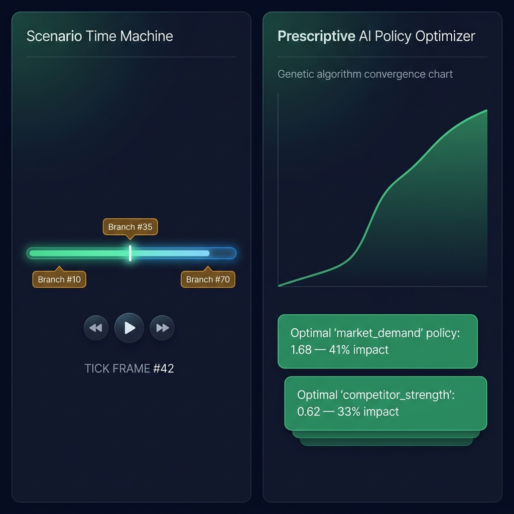
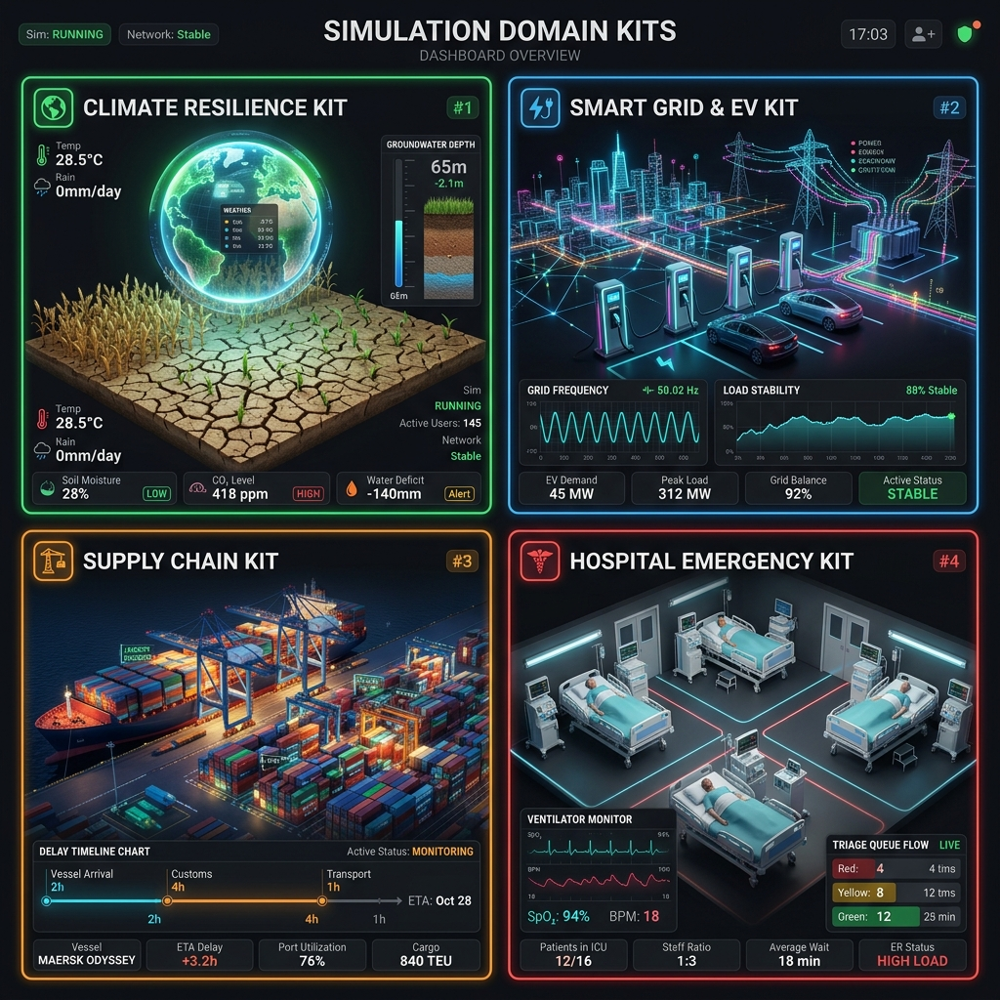

# 🌐 Real-World Simulator OS

<div align="center">


**Universal Decision Intelligence & Digital Twin Simulation Platform**

*Simulate. Predict. Prescribe. Act.*

[🚀 Quick Start](#-quick-start) • [🏗️ Architecture](#️-architecture) • [🧩 Features](#-features) • [📦 Templates](#-simulation-templates) • [🤝 Contributing](#-contributing)

</div>

---

<div align="center">



</div>

---

## 🎯 What is Real-World Simulator OS?

**Real-World Simulator OS** is an open-source, AI-powered platform that creates **living digital twins** of real-world systems. Model a startup's cash runway, a city's power grid, a hospital's ICU capacity, or a global supply chain — then run Monte Carlo simulations, deploy autonomous AI agents, and get prescriptive policy recommendations — all in real time.

> Think of it as a **flight simulator for decision makers**: a safe environment to crash test your strategy before committing to it in reality.

---

## ✨ Features

### 🤖 Autonomous Multi-Agent AI Engine

<div align="center">



</div>

Deploy virtual executive agents (**CFO, COO, Risk Manager, Medical/Logistics Leads**) that autonomously negotiate crisis responses in real time.
- Real-time debate feed with consensus confidence scoring (shown above).
- Dynamic vote tracking: `APPROVE`, `DEFER`, `REJECT`.
- Inject custom crisis directives into the agent loop interactively.

---

### 🌌 Spatial 3D Digital Twin Viewport

<div align="center">



</div>

An interactive 3D particle graph canvas renders your system architecture as a **living spatial network**.
- Orbital camera with auto-rotation controls.
- Glowing energy pulse animations along connections.
- Node state indicators: **🟢 Nominal / 🟡 Warning / 🔴 Critical Stress**.

---

### ⏳ Scenario Time Machine & 🧠 Prescriptive Policy Optimizer

<div align="center">



</div>

- **Time Machine:** Scrub simulation ticks forward and backward. Create **counterfactual branch points** to test alternative decision paths with Web Audio cue alerts.
- **Prescriptive Optimizer:** Genetic algorithm solver with SHAP feature attribution generates actionable **AI Policy Cards** with ranked parameter recommendations.

---

### 🌍 Domain-Specific Simulation Kits

<div align="center">



</div>

| Kit | Domain | Key Metrics |
|-----|--------|-------------|
| 🌱 Climate Resilience & Food Security | AgriTech | Groundwater Level, Crop Yield Index, Ambient Temp |
| ⚡ Smart Grid & EV Infrastructure | Energy | EV Demand (MW), Battery Reserve (MWh), Hz |
| 📦 Maritime Supply Chain | Global Trade | Port Backlog, Lead Time (Days), Freight Rate |
| 🏥 Hospital Emergency Triage | Public Health | ICU Beds Occupied, ER Wait Time, Ventilators |
| 🚀 Startup Growth & Run Rate | Entrepreneurship | Cash Reserves, Monthly Revenue, Burn Rate |
| 🏙️ Smart City Power Grid | Urban Infrastructure | Grid Electricity, Solar Input, City Load |
| 🌾 Crop Yield & Agriculture | AgriTech | Soil Moisture, Biomass, Precipitation |
| 🎓 University Campus | Education | Enrollment, Budget, Research Output |
| 🛒 Retail Inventory | Commerce | Stock Level, Order Rate, Demand Surge |
| 🏥 Hospital Resource Allocation | Healthcare | Bed Occupancy, Nurse Shifts, Wait Times |
| 🚢 Logistics & Supply Chain | Logistics | Transit Days, Warehouse Stock, Order Rate |
| 🌊 Disaster Response & Evacuation | Emergency Mgmt | Flood Zones, Rescue Capacity, Evacuation Speed |

---

### 🛰️ Live IoT & Sensor Data Ingestor

Real-world telemetry is polled via `/api/sensors/live` and streamed directly into your simulation's Digital Twin baseline:

| Sensor | Stream |
|--------|--------|
| `IOT-TEMP-904` | Ambient Temperature (°C) |
| `GRID-FREQ-012` | Power Grid Frequency (Hz) |
| `PORT-QUEUE-301` | Port Container Backlog (units) |
| `MED-ICU-882` | Hospital ICU Occupancy (%) |

---

## 🏗️ Architecture

```
Real-World Simulator OS/
├── backend/                    # Python FastAPI Server
│   ├── app/
│   │   ├── api/               # REST API Routes (auth, projects, runs)
│   │   ├── engines/           # Simulation Engines
│   │   │   ├── agent_engine.py         # Multi-Agent Behavioral Simulation
│   │   │   ├── des_engine.py           # Discrete Event Simulation
│   │   │   ├── monte_carlo_engine.py   # Probabilistic Monte Carlo
│   │   │   └── system_dynamics.py      # System Dynamics (Stocks & Flows)
│   │   ├── services/          # AI & Platform Services
│   │   │   ├── optimization.py         # GA Optimizer + Prescriptive Engine
│   │   │   ├── predefined_templates.py # 12 Domain Simulation Kits
│   │   │   ├── sensor_ingestion.py     # Live IoT Telemetry Ingestor ⭐
│   │   │   └── ...
│   │   └── main.py            # FastAPI App + WebSocket Streamer
│
├── frontend/                  # React + TypeScript + Vite UI
│   ├── src/
│   │   ├── components/        # Innovation Suite Components ⭐
│   │   │   ├── SpatialCanvas.tsx       # 3D Digital Twin Viewport
│   │   │   ├── MultiAgentHub.tsx       # Autonomous Agent Debate Feed
│   │   │   ├── TimeMachineScrubber.tsx # Scenario Timeline Scrubber
│   │   │   └── LiveSensorFeed.tsx      # Live IoT Telemetry Widget
│   │   └── pages/             # Application Pages
│
├── docs/images/               # README Images & Visuals
├── scripts/                   # Setup & Run Scripts
├── README.md
├── LICENSE
└── .gitignore
```

---

## 🚀 Quick Start

### Prerequisites
- Python **3.10+**
- Node.js **18+** & npm **9+**

### Windows
```powershell
git clone https://github.com/vijaymahes9080/Real-World-Simulator-OS.git
cd "Real-World Simulator OS"
./scripts/setup_windows.ps1
./scripts/run_windows.ps1
```

### Linux / macOS
```bash
git clone https://github.com/vijaymahes9080/Real-World-Simulator-OS.git
cd "Real-World Simulator OS"
chmod +x scripts/setup_unix.sh scripts/run_unix.sh
./scripts/setup_unix.sh && ./scripts/run_unix.sh
```

### Manual Setup
```bash
# Backend
cd backend && python -m venv venv
source venv/bin/activate   # Windows: venv\Scripts\activate
pip install -r requirements.txt
uvicorn app.main:app --reload --port 8000

# Frontend (new terminal)
cd frontend && npm install && npm run dev
```

| Service | URL |
|---------|-----|
| 🖥️ Frontend UI | http://localhost:5173 |
| 📡 Backend API | http://localhost:8000 |
| 📚 API Swagger Docs | http://localhost:8000/docs |

**Default credentials:** `admin` / `admin123` or `analyst` / `analyst123`

---

## 🔌 API Reference

| Endpoint | Method | Description |
|----------|--------|-------------|
| `/api/auth/login` | POST | Authenticate & receive JWT token |
| `/api/projects` | GET | List all simulation projects |
| `/api/projects/{id}/run` | POST | Start simulation run |
| `/api/projects/{id}/optimize` | POST | Run GA optimizer |
| `/api/sensors/live` | GET | Live IoT telemetry stream |
| `/api/ws/simulate` | WebSocket | Real-time simulation data stream |

---

## 🧪 Running Tests

```bash
cd backend && python -m pytest tests/ -v
```

---

## 🔧 Tech Stack

| Layer | Technology |
|-------|-----------|
| **Frontend** | React 18, TypeScript, Vite, Tailwind CSS |
| **State** | Zustand |
| **3D Viewport** | HTML5 Canvas (custom 3D projection engine) |
| **Backend** | Python 3.12, FastAPI |
| **Simulation** | NumPy, SciPy, SimPy |
| **AI/ML** | Custom GA Solver, SHAP Attribution |
| **Database** | SQLite via SQLAlchemy |
| **Auth** | JWT (python-jose) |
| **Real-Time** | WebSockets (asyncio) |

---

## 🤝 Contributing

1. Fork the repository.
2. Create your feature branch: `git checkout -b feat/my-new-feature`
3. Commit: `git commit -m 'feat: add some feature'`
4. Push: `git push origin feat/my-new-feature`
5. Submit a Pull Request.

### Commit Convention
- `feat:` — New feature
- `fix:` — Bug fix
- `docs:` — Documentation updates
- `chore:` — Build/tooling changes

---

## 📄 License

This project is licensed under the **MIT License** — see the [LICENSE](LICENSE) file for details.

---

## 👤 Author

**Vijay Mahes**
- 📧 Email: [Vijaypradhap2004@gmail.com](mailto:Vijaypradhap2004@gmail.com)
- 🐙 GitHub: [@vijaymahes9080](https://github.com/vijaymahes9080)

---

<div align="center">

Made with ❤️ by Vijay Mahes · Star ⭐ if you find it useful!

</div>
